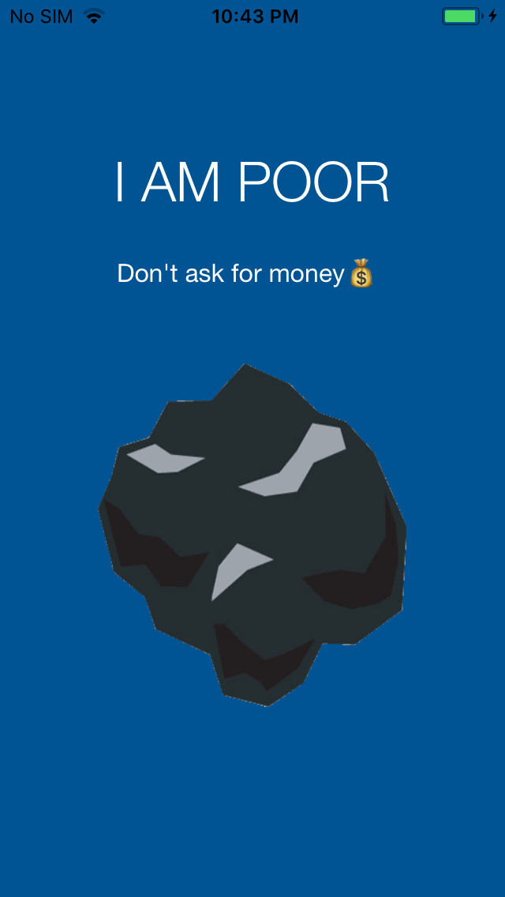

<b>I-Am-Poor</b>

Learn to make iOS Apps with The App Brewery 📱 | Project Stub | (Swift 4.0/Xcode 9) - I Am Poor App

Beginner: Download the starter project files as .zip and extract the files to your desktop.

Pro: Git clone to your Xcode projects folder.

